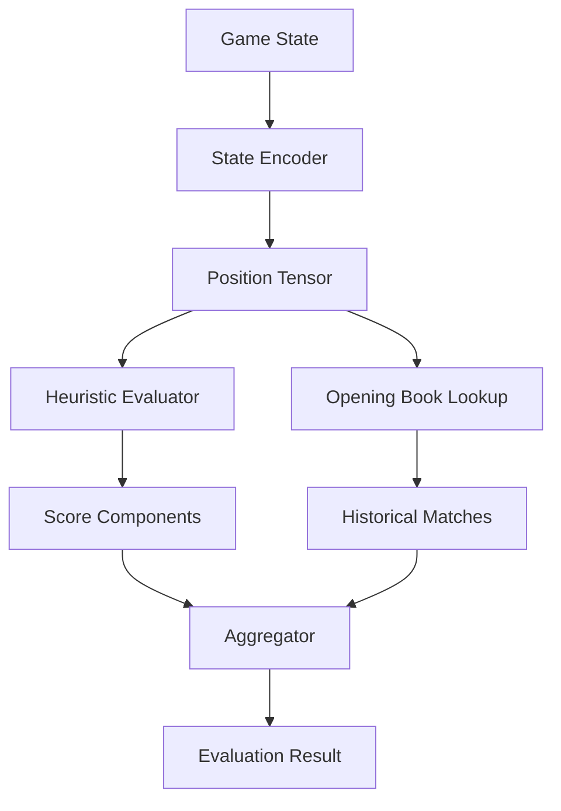

# Primordia-AI Architecture

> Agent context artifact for understanding the tactical evaluation engine.

## Purpose

Deterministic tactical evaluation engine for position analysis. Provides heuristic scoring, position encoding, and opening book lookups.

## Technology Stack

- **Language**: Python 3.11+
- **Numerics**: NumPy for position tensors
- **ML**: Optional PyTorch for learned heuristics
- **Validation**: Pydantic models
- **Testing**: Pytest + hypothesis

## Directory Structure

```
├── src/primordia_ai/
│   ├── encoder/        # Game state → tensor encoding
│   ├── heuristics/     # Evaluation functions
│   ├── opening_book/   # Known position patterns
│   ├── models/         # Domain models
│   └── overlay/        # UI integration layer
├── tests/
└── docs/
    └── HEURISTICS.md   # Evaluation model specs
```

## Component Graph



## Evaluation Model

The tactical evaluation uses weighted components:

| Component          | Weight | Description        |
| ------------------ | ------ | ------------------ |
| Board Control      | 25%    | Territory coverage |
| Threat Projection  | 25%    | Attack vectors     |
| Unit Synergy       | 20%    | Army composition   |
| Position Stability | 15%    | Defensive posture  |
| Tempo              | 15%    | Turn efficiency    |

## Integration Points

| Consumer       | Method        | Notes               |
| -------------- | ------------- | ------------------- |
| Meta-Oracle    | Python import | Feeds List Grader   |
| Logi-Slate-UI  | REST via API  | Overlay component   |
| WARScribe-Core | State import  | Uses encoded states |
